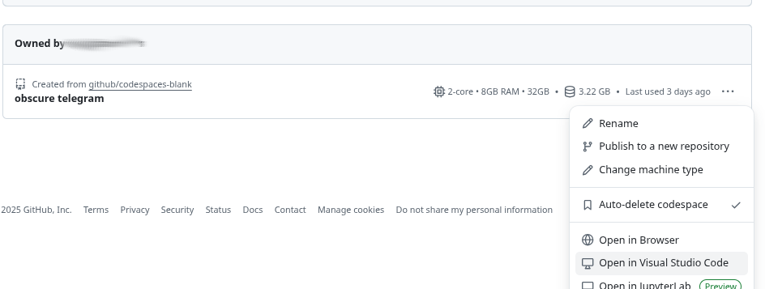

# Setup a CoPilot Environment

Requiments: Github Account

If you don't have a GitHub account yet or want a new one to use with the course, you can create one for free at [github.com](https:://github.com/).

## Option 1: Use a GitHub Codespace
To quickly set up a CoPilot environment, you can use a GitHub Codespace. This allows you to run VSCode in the cloud with all necessary extensions pre-installed.

1. Go to the [GitHub Codespaces](https://github.com/codespaces) page.
2. Use the quick start "blank" template to create a new codespace.
3. The codespace will open in the browser.

### Troubleshooting
In case of connection problems, you can also try opening the codespace in a desktop version of VSCode by clicking on the "..." menu and selecting "Open in Visual Studio Code."

## Option 2: Use a Local VSCode Installation

- Install [Visual Studio Code](https://code.visualstudio.com/).
- Install the [GitHub Copilot](https://marketplace.visualstudio.com/items?itemName=GitHub.copilot) extension.

## Other options: 

 - CoPilot is available for other IDEs, too. The functionality might be limited compared to VSCode. For example, in RStudio only inline suggestions are available, but no chat interface.